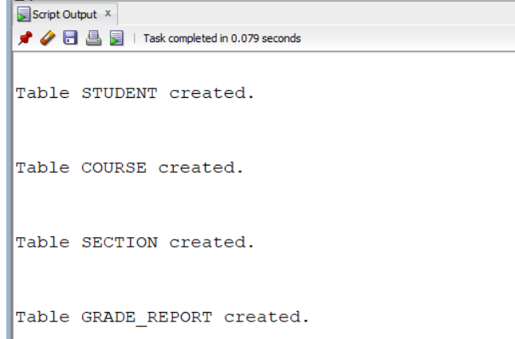
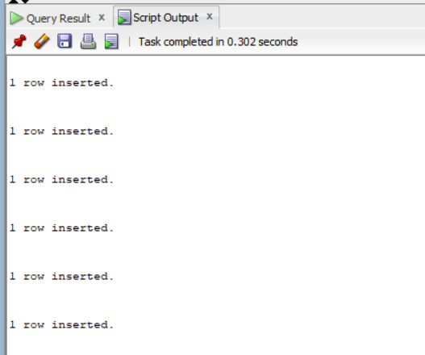
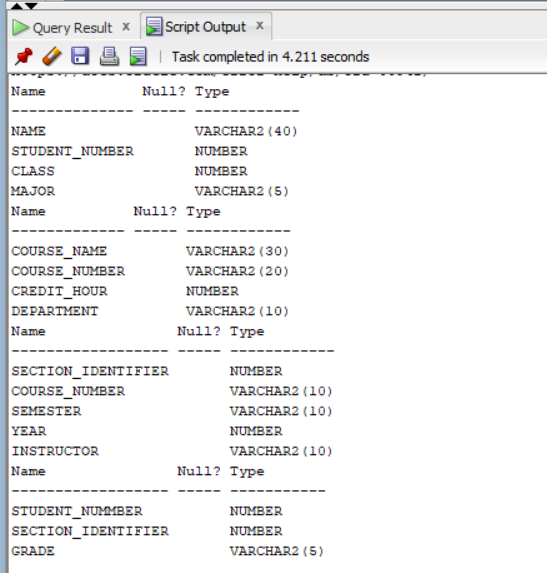
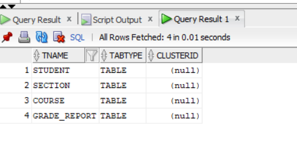
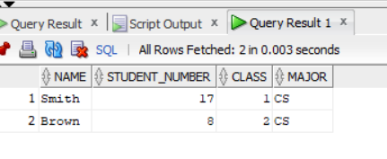
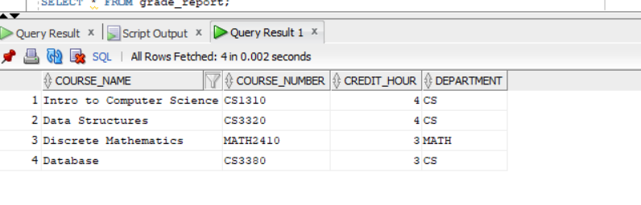
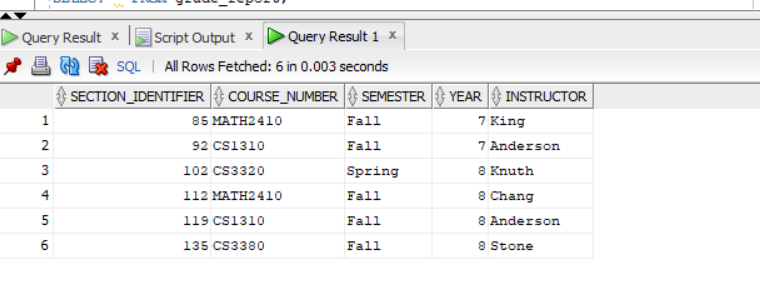
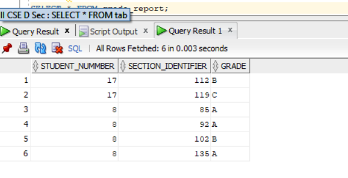
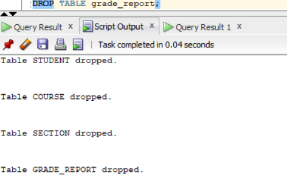

# (1a) 1.Create Table from the data base given without contraints
```
CREATE TABLE Student(
name VARCHAR2(40),
Student_number NUMBER,
Class NUMBER,
Major VARCHAR2(5)
);
CREATE TABLE course(
Course_name VARCHAR2(30),
Course_number VARCHAR2(20),
credit_hour NUMBER,
Department VARCHAR2(10)
);
CREATE TABLE Section(
Section_identifier NUMBER,
Course_number VARCHAR2(10),
Semester VARCHAR2(10),
Year NUMBER,
Instructor VARCHAR2(10)
);
CREATE TABLE grade_report(
student_nummber NUMBER,
Section_identifier NUMBER,
Grade VARCHAR2(5)
);

```

```
INSERT INTO STUDENT VALUES ('Smith', 17, 1, 'CS');
INSERT INTO STUDENT VALUES ('Brown', 8, 2, 'CS');
INSERT INTO COURSE VALUES ('Intro to Computer Science', 'CS1310', 4, 'CS');
INSERT INTO COURSE VALUES ('Data Structures', 'CS3320', 4, 'CS');
INSERT INTO COURSE VALUES ('Discrete Mathematics', 'MATH2410', 3, 'MATH');
INSERT INTO COURSE VALUES ('Database', 'CS3380', 3, 'CS');
INSERT INTO SECTION VALUES (85, 'MATH2410', 'Fall', 7, 'King');
INSERT INTO SECTION VALUES (92, 'CS1310', 'Fall', 7, 'Anderson');
INSERT INTO SECTION VALUES (102, 'CS3320', 'Spring', 8, 'Knuth');
INSERT INTO SECTION VALUES (112, 'MATH2410', 'Fall', 8, 'Chang');
INSERT INTO SECTION VALUES (119, 'CS1310', 'Fall', 8, 'Anderson');
INSERT INTO SECTION VALUES (135, 'CS3380', 'Fall', 8, 'Stone');
INSERT INTO GRADE_REPORT VALUES (17, 112, 'B');
INSERT INTO GRADE_REPORT VALUES (17, 119, 'C');
INSERT INTO GRADE_REPORT VALUES (8, 85, 'A');
INSERT INTO GRADE_REPORT VALUES (8, 92, 'A');
INSERT INTO GRADE_REPORT VALUES (8, 102, 'B');
INSERT INTO GRADE_REPORT VALUES (8, 135, 'A');
```



```
DESC student;
DESC course;
DESC section;
DESC grade_report;
```

```
SELECT * FROM tab;
```

```
SELECT * FROM student;
SELECT * FROM course;
SELECT * FROM section;
SELECT * FROM grade_report;
```




```
DROP TABLE student;
DROP TABLE course;
DROP TABLE section;
DROP TABLE grade_report;
```

```

