# (1b) 1. CREATE TABLES
```

CREATE TABLE Student (
    Name            VARCHAR2(30),
    Student_number  NUMBER(5),
    Class           NUMBER(2),
    Major           VARCHAR2(10),
    CONSTRAINT pk_student PRIMARY KEY (Student_number)
);

CREATE TABLE Course (
    Course_name     VARCHAR2(50),
    Course_number   VARCHAR2(10),
    Credit_hours    NUMBER(2),
    Department      VARCHAR2(10),
    CONSTRAINT pk_course PRIMARY KEY (Course_number)
);

CREATE TABLE Section (
    Section_identifier NUMBER(5),
    Course_number      VARCHAR2(10),
    Semester            VARCHAR2(10),
    Year                NUMBER(2),
    Instructor          VARCHAR2(30),
    CONSTRAINT pk_section PRIMARY KEY (Section_identifier),
    CONSTRAINT fk_section_course
        FOREIGN KEY (Course_number)
        REFERENCES Course(Course_number)
);

CREATE TABLE Grade_Report (
    Student_number     NUMBER(5),
    Section_identifier NUMBER(5),
    Grade              VARCHAR2(2),
    CONSTRAINT pk_grade_report
        PRIMARY KEY (Student_number, Section_identifier),
    CONSTRAINT fk_grade_student
        FOREIGN KEY (Student_number)
        REFERENCES Student(Student_number),
    CONSTRAINT fk_grade_section
        FOREIGN KEY (Section_identifier)
        REFERENCES Section(Section_identifier)
);

CREATE TABLE Prerequisite (
    Course_number       VARCHAR2(10),
    Prerequisite_number VARCHAR2(10),
    CONSTRAINT pk_prerequisite
        PRIMARY KEY (Course_number, Prerequisite_number),
    CONSTRAINT fk_prereq_course
        FOREIGN KEY (Course_number)
        REFERENCES Course(Course_number),
    CONSTRAINT fk_prereq_required
        FOREIGN KEY (Prerequisite_number)
        REFERENCES Course(Course_number)
);
```
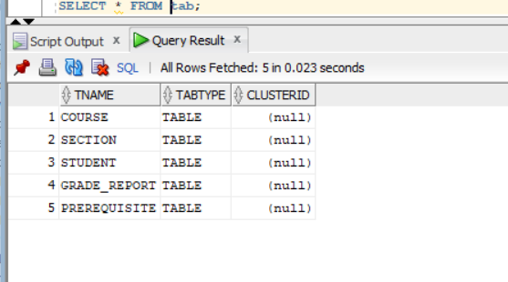
```

```
# (1b) 2.Display
```
DESC Student;
DESC Course;
DESC Section;
DESC Grade_Report;
DESC Prerequisite;
```

```

```
# (1b) 3.Insert
```
-- STUDENT
INSERT INTO Student VALUES ('Smith', 17, 1, 'CS');
INSERT INTO Student VALUES ('Brown', 8, 2, 'CS');

-- COURSE
INSERT INTO Course VALUES ('Intro to Computer Science', 'CS1310', 4, 'CS');
INSERT INTO Course VALUES ('Data Structures', 'CS3320', 4, 'CS');
INSERT INTO Course VALUES ('Discrete Mathematics', 'MATH2410', 3, 'MATH');
INSERT INTO Course VALUES ('Database', 'CS3380', 3, 'CS');

-- SECTION
INSERT INTO Section VALUES (85,  'MATH2410', 'Fall',   07, 'King');
INSERT INTO Section VALUES (92,  'CS1310',   'Fall',   07, 'Anderson');
INSERT INTO Section VALUES (102, 'CS3320',   'Spring', 08, 'Knuth');
INSERT INTO Section VALUES (112, 'MATH2410', 'Fall',   08, 'Chang');
INSERT INTO Section VALUES (119, 'CS1310',   'Fall',   08, 'Anderson');
INSERT INTO Section VALUES (135, 'CS3380',   'Fall',   08, 'Stone');

-- GRADE_REPORT
INSERT INTO Grade_Report VALUES (17, 112, 'B');
INSERT INTO Grade_Report VALUES (17, 119, 'C');
INSERT INTO Grade_Report VALUES (8,  85,  'A');
INSERT INTO Grade_Report VALUES (8,  92,  'A');
INSERT INTO Grade_Report VALUES (8,  102, 'B');
INSERT INTO Grade_Report VALUES (8,  135, 'A');

-- PREREQUISITE
INSERT INTO Prerequisite VALUES ('CS3380', 'CS3320');
INSERT INTO Prerequisite VALUES ('CS3380', 'MATH2410');
INSERT INTO Prerequisite VALUES ('CS3320', 'CS1310');
```
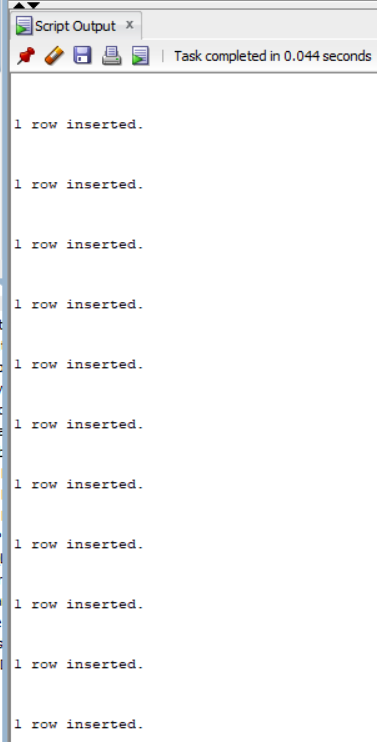
```
```
# (1b) 4.display
```
SELECT * FROM Student;
SELECT * FROM Course;
SELECT * FROM Section;
SELECT * FROM Grade_Report;
SELECT * FROM Prerequisite;
```
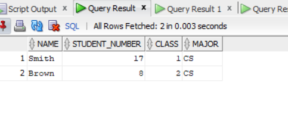
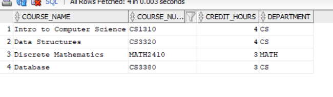
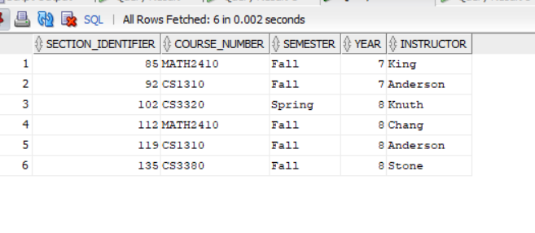
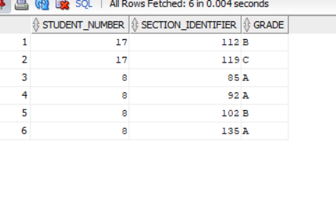
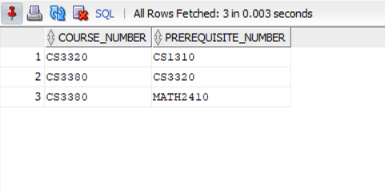
```
```
# (1b) 5.Alter
```
ALTER TABLE Student
ADD Branch VARCHAR2(10);

DESC Student;

SELECT Branch
FROM Student;
```
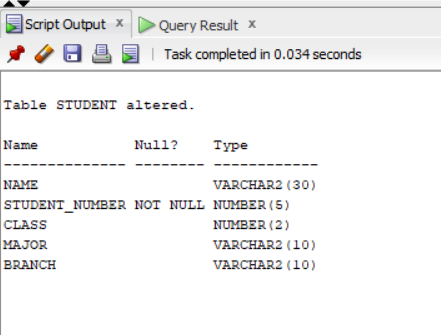
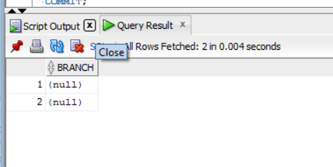
```

```
# (1b) 6.Copy Major Values into Branch
```
UPDATE Student
SET Branch = Major;

COMMIT;

SELECT Name, Student_number, Class, Major, Branch
FROM Student;
```
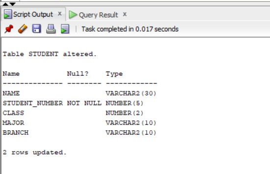
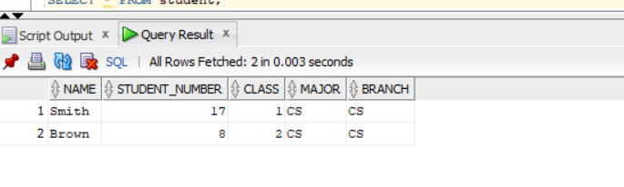
```

```
# (1b) 7.Remove the major atribute from the student
```
ALTER TABLE Student
DROP COLUMN Major;

DESC Student;
```
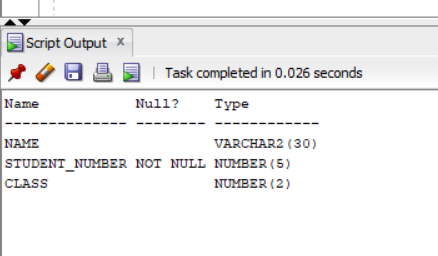
```
```
# (1b) 8.Change course_number to cid in course and describe it
```
ALTER TABLE Course
RENAME COLUMN Course_number TO cid;

DESC Course;
```
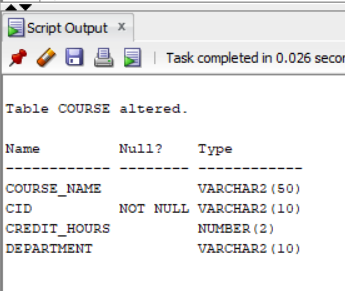
```
```
# (1b) 9.Change credit_hoours of database to 4
```
UPDATE Course
SET Credit_hours = 4
WHERE Course_name = 'Database';

COMMIT;

SELECT *
FROM Course
WHERE Course_name = 'Database';
```
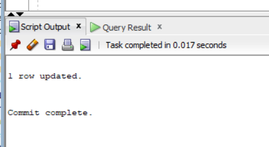
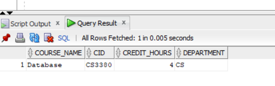
```
```
# (1b) 10.Put NOT NULL constraints to brannch in sttudent
```
ALTER TABLE Student
MODIFY Branch VARCHAR2(10) NOT NULL;

DESC Student;
```
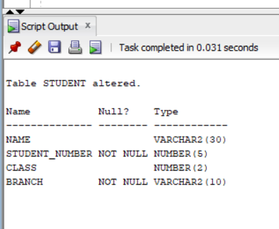
```
```
# (1b) 11.Rename student table to pupil
```
ALTER TABLE Student
RENAME TO Pupil;

DESC Pupil;
```
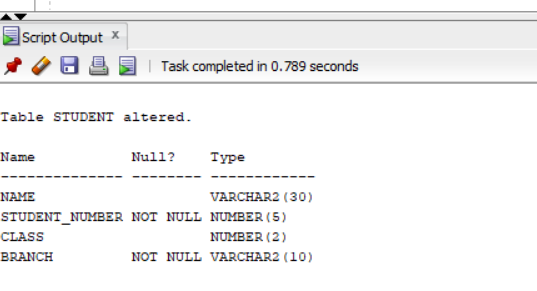
```
```
# (1b) 13.Remove rows having Fall semester in section
```
DELETE FROM Section
WHERE Semester = 'Fall';

COMMIT;

SELECT * FROM Section;
```


```
```
# (1b) 14.Remove therow of Data structure in course
```
DELETE FROM Course
WHERE course_name='Data Structure';
```
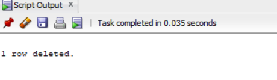
```
```
# (1b) 15.Remove all rows usings TRUNCATE
```
TRUNCATE TABLE Grade_Report;
TRUNCATE TABLE Prerequisite;
TRUNCATE TABLE Section;
TRUNCATE TABLE Pupil;
TRUNCATE TABLE Course;
```
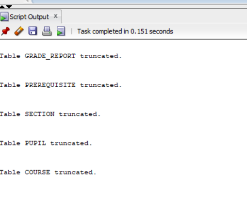
```
```
# (1b) 17.permanently remove grade_report and prerequisite
```
DROP TABLE Grade_Report PURGE;
DROP TABLE Prerequisite PURGE;
```
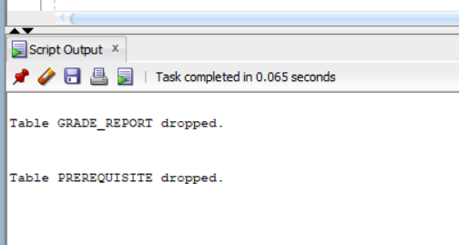
```

 
```
# (1b) 16.Remove pupil,course and section
```
DROP TABLE Pupil;
DROP TABLE Section;
DROP TABLE course CASCADE CONSTRAINTS;
```
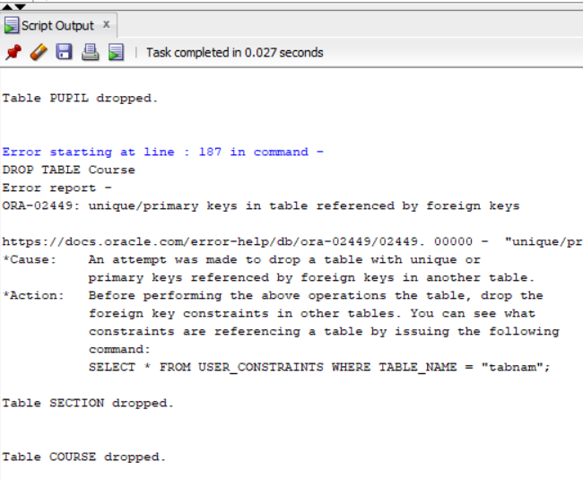
```
```
# (1b) 12.Remove the student table
```
DROP FROM student;
```
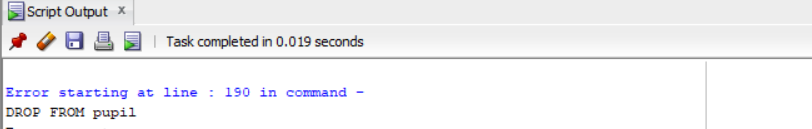
```
