# 2.Design the folllowing database using DDL and DML statment
```
CREATE TABLE Sailors (
    sid INTEGER PRIMARY KEY,
    sname VARCHAR2(20),
    rating INTEGER,
    age NUMBER(4,1)
);

CREATE TABLE Boats (
    bid INTEGER PRIMARY KEY,
    bname VARCHAR2(20),
    color VARCHAR2(10)
);

CREATE TABLE Reserves (
    sid INTEGER,
    bid INTEGER,
    day DATE,
    PRIMARY KEY (sid, bid, day),
    FOREIGN KEY (sid) REFERENCES Sailors(sid),
    FOREIGN KEY (bid) REFERENCES Boats(bid)
);
```
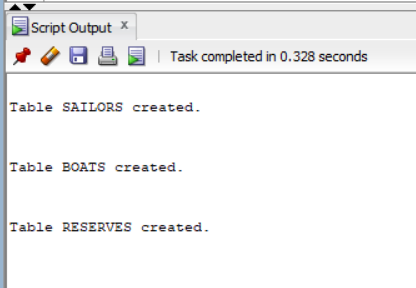
```
INSERT INTO Sailors VALUES (22, 'Dustin', 7, 45.0);
INSERT INTO Sailors VALUES (29, 'Brutus', 1, 33.0);
INSERT INTO Sailors VALUES (31, 'Lubber', 8, 55.5);
INSERT INTO Sailors VALUES (32, 'Andy', 8, 25.5);
INSERT INTO Sailors VALUES (58, 'Rusty', 10, 35.0);
INSERT INTO Sailors VALUES (64, 'Horatio', 7, 35.0);
INSERT INTO Sailors VALUES (71, 'Zorba', 10, 16.0);
INSERT INTO Sailors VALUES (74, 'Horatio', 9, 35.0);
INSERT INTO Sailors VALUES (85, 'Art', 3, 25.5);
INSERT INTO Sailors VALUES (95, 'Bob', 3, 63.5);
```
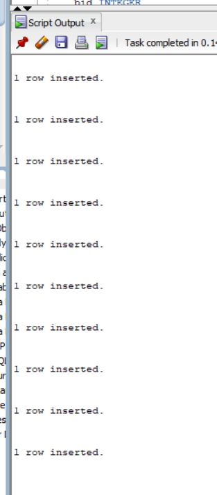
```
INSERT INTO Boats VALUES (101, 'Interlake', 'blue');
INSERT INTO Boats VALUES (102, 'Interlake', 'red');
INSERT INTO Boats VALUES (103, 'Clipper', 'green');
INSERT INTO Boats VALUES (104, 'Marine', 'red');
```
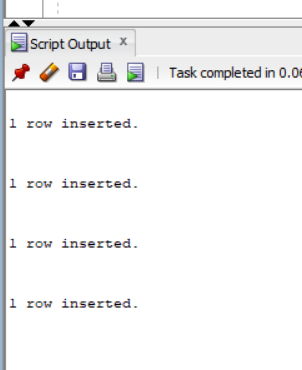
```
INSERT INTO Reserves VALUES (22, 101, TO_DATE('10/10/98','MM/DD/RR'));
INSERT INTO Reserves VALUES (22, 102, TO_DATE('10/10/98','MM/DD/RR'));
INSERT INTO Reserves VALUES (22, 103, TO_DATE('10/08/98','MM/DD/RR'));
INSERT INTO Reserves VALUES (22, 104, TO_DATE('10/07/98','MM/DD/RR'));

INSERT INTO Reserves VALUES (31, 102, TO_DATE('11/10/98','MM/DD/RR'));
INSERT INTO Reserves VALUES (31, 103, TO_DATE('11/06/98','MM/DD/RR'));
INSERT INTO Reserves VALUES (31, 104, TO_DATE('11/12/98','MM/DD/RR'));

INSERT INTO Reserves VALUES (64, 101, TO_DATE('09/05/98','MM/DD/RR'));
INSERT INTO Reserves VALUES (64, 102, TO_DATE('09/08/98','MM/DD/RR'));
INSERT INTO Reserves VALUES (74, 103, TO_DATE('09/08/98','MM/DD/RR'));
```
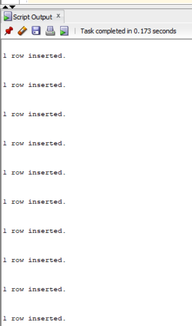
```
# 2.1.Names and ages of all sailors
```
```
SELECT sname,age
FROM sailors;
```
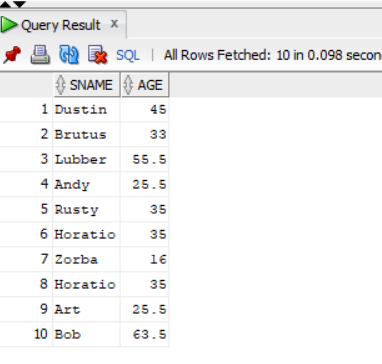
```
# 2.2.Sailors with rating above 7
```
```
SELECT *
FROM Sailors
WHERE rating > 7;
```
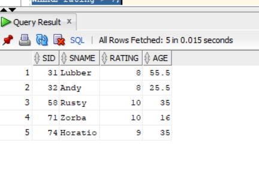
```
```
# 2.3.Names of sailors who reserved boat 103
```
SELECT DISTINCT S.sname
FROM Sailors S, Reserves R
WHERE S.sid = R.sid
AND R.bid = 103;
```
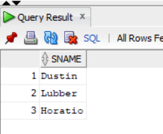
```
```
# 2.4.SIDs of sailors who reserved a red boat
```
SELECT DISTINCT R.sid
FROM Reserves R, Boats B
WHERE R.bid = B.bid
AND B.color = 'red';
```
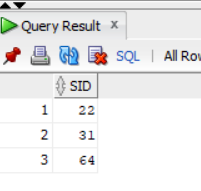
```
```
# 2.5. Names of sailors who reserved a red boat
```
SELECT DISTINCT S.sname
FROM Sailors S, Reserves R, Boats B
WHERE S.sid = R.sid
AND R.bid = B.bid
AND B.color = 'red';
```
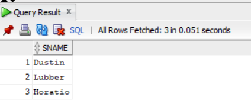
```
```
# 2.6.Colors of boats reserved by Lubber
```
SELECT DISTINCT B.color
FROM Sailors S, Reserves R, Boats B
WHERE S.sid = R.sid
AND R.bid = B.bid
AND S.sname = 'Lubber';
```
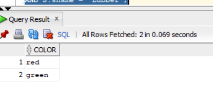
```
```
# 2.7.Names of sailors who reserved at least one boat
```
SELECT DISTINCT S.sname
FROM Sailors S, Reserves R
WHERE S.sid = R.sid;
```
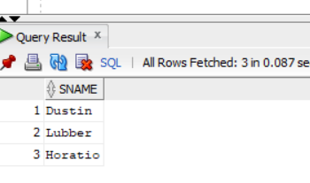
```
```
# 2.8.Increment ratings of sailors who sailed two different boats on the same day
```
UPDATE Sailors
SET rating = rating + 1
WHERE sid IN (
    SELECT R1.sid
    FROM Reserves R1, Reserves R2
    WHERE R1.sid = R2.sid
    AND R1.day = R2.day
    AND R1.bid <> R2.bid
);
```
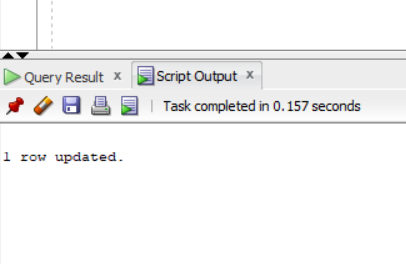
```
```
# 2.9.Ages of sailors whose name begins and ends with B and has at least 3 characters
```
SELECT age
FROM Sailors
WHERE sname LIKE 'B%B'
AND LENGTH(sname) >= 3;
```
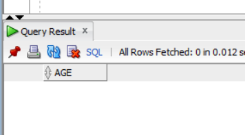
```
```
# 2.10.Names of sailors who reserved a red boat or a green boat
```
SELECT DISTINCT S.sname
FROM Sailors S, Reserves R, Boats B
WHERE S.sid = R.sid
AND R.bid = B.bid
AND B.color IN ('red', 'green');
```
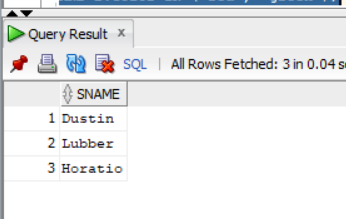
```
```
# 2.11.Names of sailors who reserved both red and green boats
```
SELECT S.sname
FROM Sailors S
WHERE EXISTS (
    SELECT *
    FROM Reserves R, Boats B
    WHERE R.sid = S.sid
    AND R.bid = B.bid
    AND B.color = 'red'
)
AND EXISTS (
    SELECT *
    FROM Reserves R, Boats B
    WHERE R.sid = S.sid
    AND R.bid = B.bid
    AND B.color = 'green'
);
```
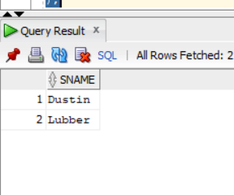
```
# 2.12.SIDs of sailors who reserved red boats but not green boat
```
```
SELECT DISTINCT R.sid
FROM Reserves R, Boats B
WHERE R.bid = B.bid
AND B.color = 'red'
AND R.sid NOT IN (
    SELECT R2.sid
    FROM Reserves R2, Boats B2
    WHERE R2.bid = B2.bid
    AND B2.color = 'green'
);
```
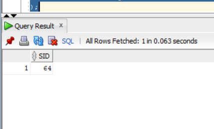
```
# 2.13.SIDs of sailors with rating 10 or who reserved boat 104
```
```
SELECT sid
FROM Sailors
WHERE rating = 10

UNION

SELECT sid
FROM Reserves
WHERE bid = 104;
```
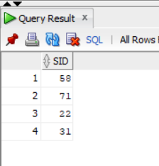
```
```
# 2.14.Names of sailors who reserved boat 103
```
SELECT DISTINCT S.sname
FROM Sailors S, Reserves R
WHERE S.sid = R.sid
AND R.bid = 103;
```
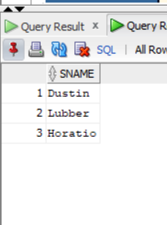
```
```
# 2.15.Names of sailors who reserved a red boat
```
SELECT DISTINCT S.sname
FROM Sailors S, Reserves R, Boats B
WHERE S.sid = R.sid
AND R.bid = B.bid
AND B.color = 'red';
```
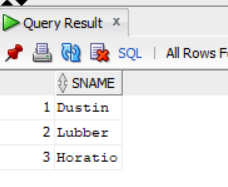
```
```
# 2.16.Names of sailors who reserved boat 103
```
SELECT DISTINCT S.sname
FROM Sailors S, Reserves R
WHERE S.sid = R.sid
AND R.bid = 103;
```
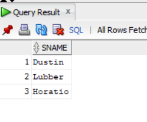
```
```
# 2.17.Sailors whose rating is better than some sailor called Horatio
```
SELECT *
FROM Sailors
WHERE rating > ANY (
    SELECT rating
    FROM Sailors
    WHERE sname = 'Horatio'
);
```
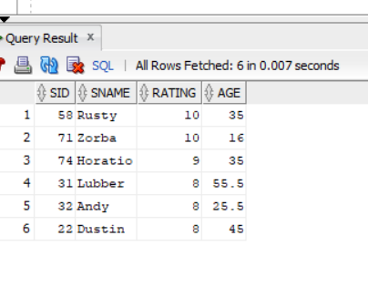
```
```
# 2.18.Sailors whose rating is better than every sailor called Horatio
```
SELECT *
FROM Sailors
WHERE rating > ALL (
    SELECT rating
    FROM Sailors
    WHERE sname = 'Horatio'
);
```
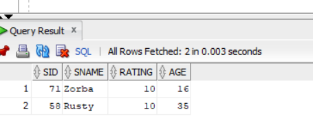
```
```
# 2.19.Sailors with the highest rating
```
SELECT *
FROM Sailors
WHERE rating = (
    SELECT MAX(rating)
    FROM Sailors
);
```
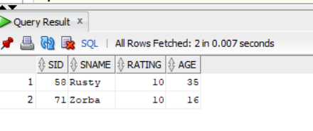
```
# 2.20.Names of sailors who reserved both red and green boats
```
```
SELECT S.sname
FROM Sailors S
WHERE EXISTS (
    SELECT *
    FROM Reserves R, Boats B
    WHERE R.sid = S.sid
    AND R.bid = B.bid
    AND B.color = 'red'
)
AND EXISTS (
    SELECT *
    FROM Reserves R, Boats B
    WHERE R.sid = S.sid
    AND R.bid = B.bid
    AND B.color = 'green'
);
```
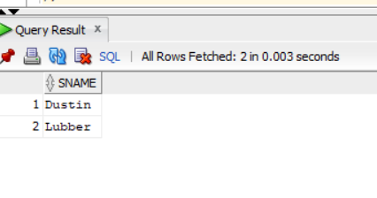
```
```
# 2.21.Names of sailors who reserved all boats
```
SELECT S.sname
FROM Sailors S
WHERE NOT EXISTS (
    SELECT B.bid
    FROM Boats B
    WHERE NOT EXISTS (
        SELECT R.bid
        FROM Reserves R
        WHERE R.sid = S.sid
        AND R.bid = B.bid
    )
);
```
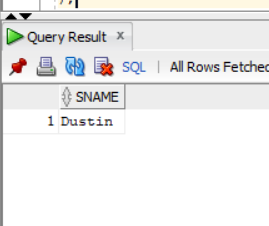
```
```
# 2.22.Average age of all sailors
```
SELECT AVG(age) AS average_age
FROM Sailors;
```
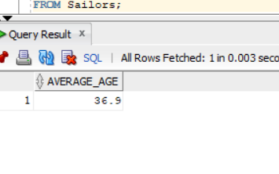
```
```
# 2.23.Average age of sailors with rating 10
```
SELECT AVG(age) AS average_age
FROM Sailors
WHERE rating=10;
```
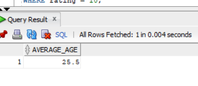
```
```
# 2.24.Name and age of the oldest sailor
```
SELECT sname, age
FROM Sailors
WHERE age = (
    SELECT MAX(age)
    FROM Sailors
);
```
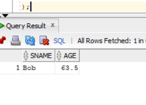
```
```
# 2.25.Count the number of sailors
```
SELECT COUNT(*) AS total_sailors
FROM Sailors;
```
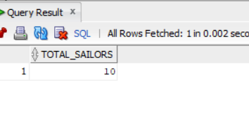
```
```
# 2.26.Count the number of different sailor names
```
SELECT COUNT(DISTINCT sname) AS different_names
FROM Sailors;
```
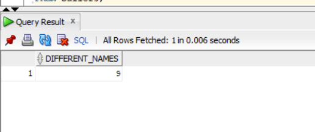
```
```
# 2.27.Sailors older than the oldest sailor with rating 10
```
SELECT sname
FROM Sailors
WHERE age > (
    SELECT MAX(age)
    FROM Sailors
    WHERE rating = 10
);
```
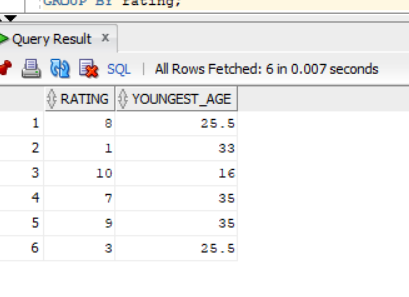
```
```
# 2.28.Age of the youngest sailor for each rating level
```
SELECT rating, MIN(age) AS youngest_age
FROM Sailors
GROUP BY rating;
```
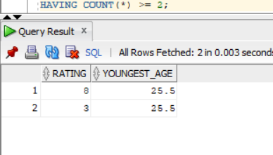
```
```
# 2.29.Youngest eligible sailor for each rating with at least two eligible sailors
```
SELECT rating, MIN(age) AS youngest_age
FROM Sailors
WHERE age >= 18
GROUP BY rating
HAVING COUNT(*) >= 2;
```
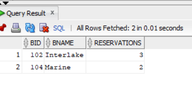
```
```
# 2.30.For each red boat, find the number of reservations
```
SELECT B.bid, B.bname, COUNT(R.sid) AS reservations
FROM Boats B
LEFT JOIN Reserves R ON B.bid = R.bid
WHERE B.color = 'red'
GROUP BY B.bid, B.bname;
```
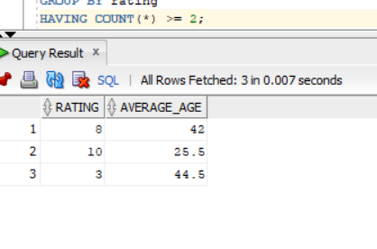
```
```
# 2.31.Average age for each rating level having at least two sailors
```
SELECT rating, AVG(age) AS average_age
FROM Sailors
GROUP BY rating
HAVING COUNT(*) >= 2;
```
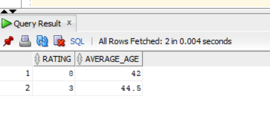
```
```
# 2.32.Average age of voting-age sailors for each rating with at least two such sailors
```
SELECT rating, AVG(age) AS average_age
FROM Sailors
WHERE age >= 18
GROUP BY rating
HAVING COUNT(*) >= 2;
```
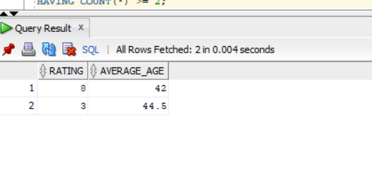
```
```
# 2.33.Average age of voting-age sailors for each rating with at least two such sailors
```
SELECT rating, AVG(age) AS average_age
FROM Sailors
WHERE age >= 18
GROUP BY rating
HAVING COUNT(*) >= 2;
```
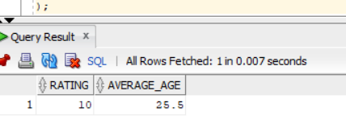
```
```
# 2.34.Ratings for which the average age is minimum
```
SELECT rating, AVG(age) AS average_age
FROM Sailors
GROUP BY rating
HAVING AVG(age) = (
    SELECT MIN(avg_age)
    FROM (
        SELECT AVG(age) AS avg_age
        FROM Sailors
        GROUP BY rating
    )
);
```
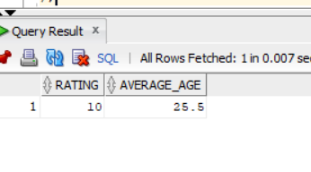
```
```

