#3.b.CREATE TABLE
```
CREATE TABLE EMPLOYEES (
    EMPLOYEE_ID NUMBER PRIMARY KEY,
    FIRST_NAME VARCHAR2(30),
    LAST_NAME VARCHAR2(30),
    DEPARTMENT VARCHAR2(30),
    SALARY NUMBER(10,2),
    CITY VARCHAR2(30),
    GENDER VARCHAR2(10),
    HIRE_DATE DATE
);
```
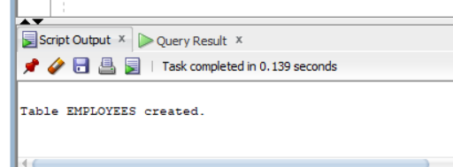
```
```
#3.b.INSERT VALUE
```
INSERT INTO EMPLOYEES VALUES
(101, 'Rahul', 'Kumar', 'IT', 65000, 'Hyderabad', 'Male', DATE '2020-01-15');

INSERT INTO EMPLOYEES VALUES
(102, 'Priya', 'Reddy', 'HR', 55000, 'Anantapur', 'Female', DATE '2019-06-10');


INSERT INTO EMPLOYEES VALUES
(103, 'Arun', 'Sharma', 'Sales', 72000, 'Hyderabad', 'Male', DATE '2021-03-20');

INSERT INTO EMPLOYEES VALUES
(104, 'Sneha', 'Rao', 'IT', 80000, 'Bangalore', 'Female', DATE '2022-07-12');

INSERT INTO EMPLOYEES VALUES
(105, 'Kiran', 'Kumar', 'Marketing', 60000, 'Chennai', 'Male', DATE '2020-09-05');

INSERT INTO EMPLOYEES VALUES
(106, 'Anjali', 'Reddy', 'Sales', 75000, 'Hyderabad', 'Female', DATE '2021-11-18');

INSERT INTO EMPLOYEES VALUES
(107, 'Ravi', 'Naidu', 'HR', 50000, 'Anantapur', 'Male', DATE '2018-04-25');

INSERT INTO EMPLOYEES VALUES
(108, 'Divya', 'Sharma', 'IT', 90000, 'Hyderabad', 'Female', DATE '2023-02-10');

INSERT INTO EMPLOYEES VALUES
(109, 'Suresh', 'Rao', 'Marketing', 68000, 'Hyderabad', 'Male', DATE '2020-12-01');

INSERT INTO EMPLOYEES VALUES
(110, 'Lakshmi', 'Devi', 'HR', 58000, 'Chennai', 'Female', DATE '2022-05-15');
```
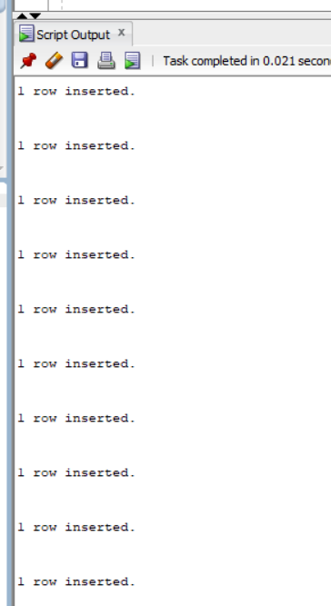
```
```
#3.b.Q1. Create EMP_VIEW displaying all columns
```
CREATE VIEW EMP_VIEW AS
SELECT *
FROM EMPLOYEES;
```
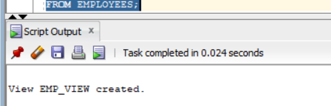
```
```
#3.b.Q2. Create EMP_BASIC
```
CREATE VIEW EMP_BASIC AS
SELECT EMPLOYEE_ID, FIRST_NAME, LAST_NAME, DEPARTMENT, SALARY
FROM EMPLOYEES;
```
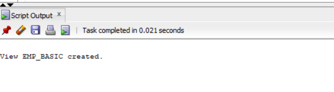
```
```
#3.b.Q3. Display all records from EMP_VIEW
```
SELECT *
FROM EMP_VIEW;
```
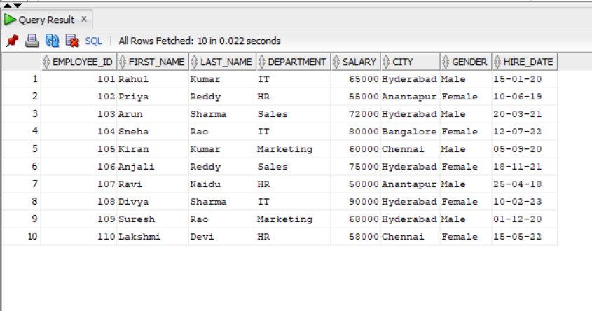
```
```
#3.b.Q4. Create IT_EMPLOYEES
```
CREATE VIEW IT_EMPLOYEES AS
SELECT *
FROM EMPLOYEES
WHERE DEPARTMENT = 'IT';
```
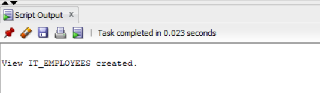
```
```
#3.b.Q5. Create HIGH_SALARY
```
``CREATE VIEW HIGH_SALARY AS
SELECT *
FROM EMPLOYEES
WHERE SALARY > 60000;
```
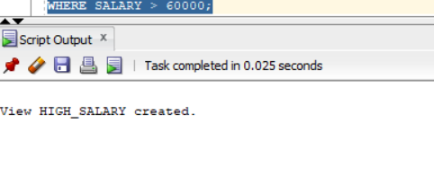
```
```
#3.b.Q6. Create HYDERABAD_EMP
```CREATE VIEW HYDERABAD_EMP AS
SELECT *
FROM EMPLOYEES
WHERE CITY = 'Hyderabad';
```
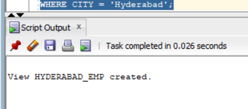
```
#3.b.Q7. Create FEMALE_EMP
```
```
CREATE VIEW FEMALE_EMP AS
SELECT *
FROM EMPLOYEES
WHERE GENDER = 'Female';
```
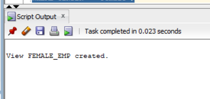
```
```
#3.b.Q8. Create RECENT_EMPLOYEES
```
CREATE VIEW RECENT_EMPLOYEES AS
SELECT *
FROM EMPLOYEES
WHERE HIRE_DATE >= DATE '2020-01-01';
```
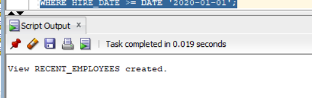
```
```
#3.b.Q9. Display Employee ID, First Name and Salary from HIGH_SALARY
```
SELECT EMPLOYEE_ID, FIRST_NAME, SALARY
FROM HIGH_SALARY;
```
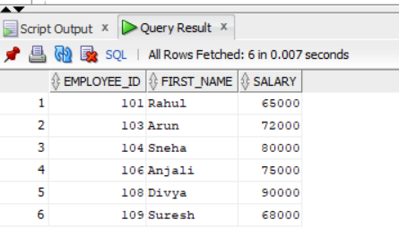
```
```
#3.b.Q10. Replace EMP_BASIC by adding CITY
```CREATE OR REPLACE VIEW EMP_BASIC AS
SELECT EMPLOYEE_ID, FIRST_NAME, LAST_NAME,
       DEPARTMENT, SALARY, CITY
FROM EMPLOYEES;
```
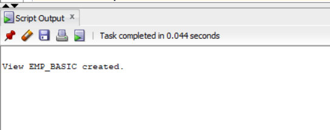
```
```
#3.b.Q11. Create read-only EMP_SALARY_VIEW
```
CREATE VIEW EMP_SALARY_VIEW AS
SELECT EMPLOYEE_ID, FIRST_NAME, LAST_NAME, SALARY
FROM EMPLOYEES
WITH READ ONLY;
```
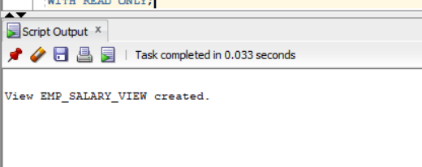
```
```
#3.b.Q12. Create SALES_EMP with CHECK OPTION
```
CREATE VIEW SALES_EMP AS
SELECT *
FROM EMPLOYEES
WHERE DEPARTMENT = 'Sales'
WITH CHECK OPTION;
```
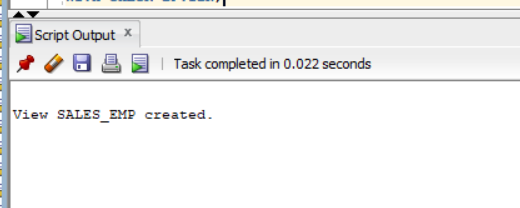
```
#3.b.Q13. Update salary of employee 101 through EMP_BASIC
```
```
UPDATE EMP_BASIC
SET SALARY = 70000
WHERE EMPLOYEE_ID = 101;
```
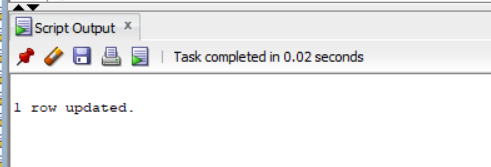
```
```
#3.b.Q14. Delete employee 107 through EMP_VIEW
```
DELETE FROM EMP_VIEW
WHERE EMPLOYEE_ID = 107;
```
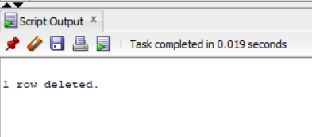
```
```
#3.b.Q15. Insert a new employee through EMP_BASIC
```
INSERT INTO EMP_BASIC
(EMPLOYEE_ID, FIRST_NAME, LAST_NAME, DEPARTMENT, SALARY, CITY)
VALUES
(111, 'Neha', 'Reddy', 'IT', 65000, 'Hyderabad');
```
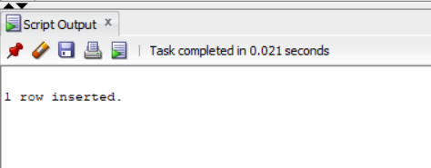
```
```
#3.b.Q16. Display structure of EMP_BASIC
```
DESC EMP_BASIC;
```
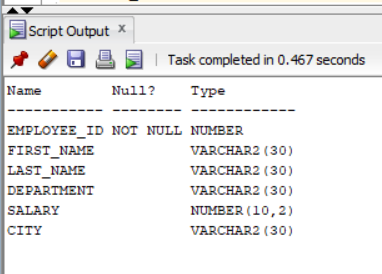
```
```
#3.b.Q17. Display all records from IT_EMPLOYEES
```
SELECT *
FROM IT_EMPLOYEES;
```
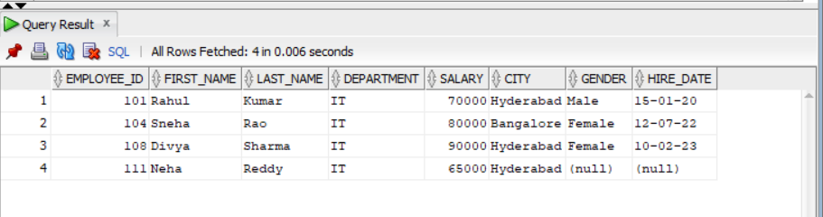
```
```
#3.b.Q18. Display employees from HIGH_SALARY whose salary > 70000
```
SELECT *
FROM HIGH_SALARY
WHERE SALARY > 70000;
```
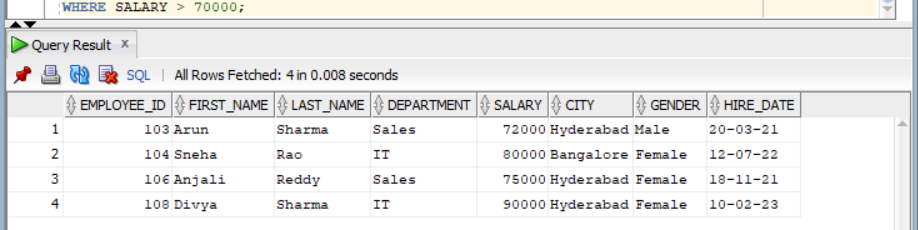
```
```
#3.b.Q19. Display all female employees
```
SELECT *
FROM FEMALE_EMP;
```
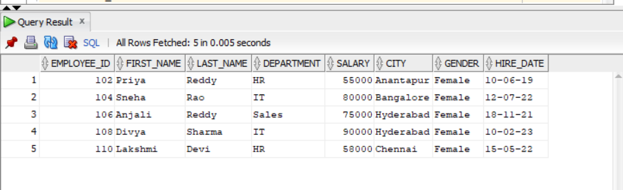
```
```
#3.b.Q20. Display names and salaries from HYDERABAD_EMP
```
SELECT FIRST_NAME, LAST_NAME, SALARY
FROM HYDERABAD_EMP;
```
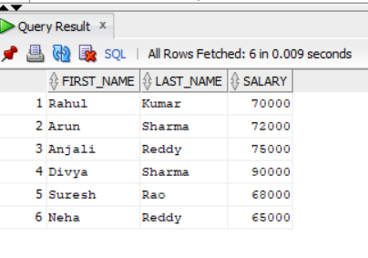
```
```
#3.b.Q21. Drop EMP_VIEW
```
DROP VIEW EMP_VIEW;
```
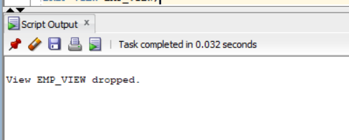
```
```
#3.b.Q22. Drop HIGH_SALARY
```
DROP VIEW HIGH_SALARY;
```
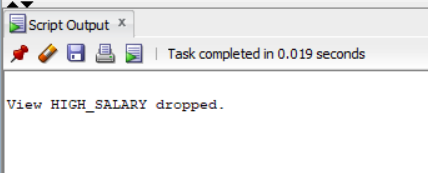
```
```
#3.b.Q23. Drop EMP_BASIC
```
DROP VIEW EMP_BASIC;
```
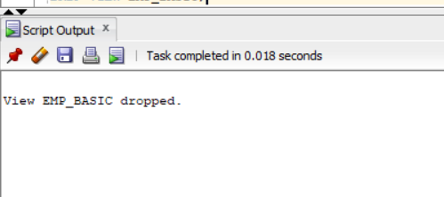
```
```
#3.b.Q24. Create HR_EMPLOYEES
```
CREATE VIEW HR_EMPLOYEES AS
SELECT *
FROM EMPLOYEES
WHERE DEPARTMENT = 'HR';
```
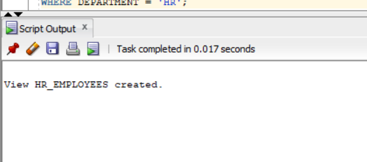
```
```
#3.b.Q25. Create MARKETING_EMP
```
CREATE VIEW MARKETING_EMP AS
SELECT EMPLOYEE_ID, FIRST_NAME, LAST_NAME,
       DEPARTMENT, SALARY
FROM EMPLOYEES
WHERE DEPARTMENT = 'Marketing';
```
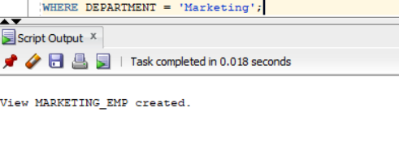
```
```
#3.b.Q26. Create TOP_EARNERS
```
CREATE VIEW TOP_EARNERS AS
SELECT *
FROM EMPLOYEES
WHERE SALARY > 70000;
```
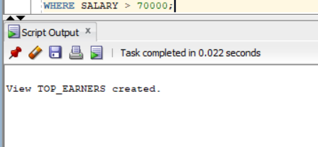
```
```
#3.b.Q27. Create EMP_CITY
```
CREATE VIEW EMP_CITY AS
SELECT EMPLOYEE_ID, FIRST_NAME, LAST_NAME, CITY
FROM EMPLOYEES
```
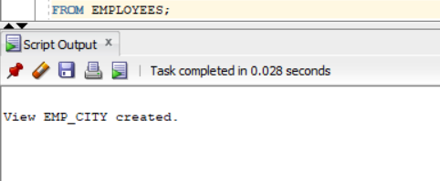

