#4.Q1. Create a DEPT table having DNO, DNAME as columns.
```
CREATE TABLE DEPT
(
    DNO NUMBER,
    DNAME VARCHAR2(30)
);
```
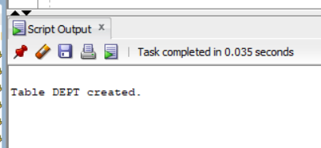
```
```
#4.Q2. Apply Primary Key constraint for DNO and NOT NULL constraint for DNAME.
```
ALTER TABLE DEPT
ADD CONSTRAINT PK_DEPT PRIMARY KEY (DNO);

ALTER TABLE DEPT
MODIFY DNAME NOT NULL;
```
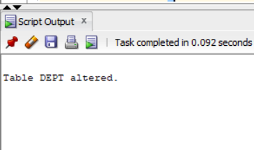
```
```
#4.Q3. Create a STUDENT table having SID, SNAME, and DID as columns.
```
CREATE TABLE STUDENT
(
    SID NUMBER,
    SNAME VARCHAR2(30),
    DID NUMBER
);
```
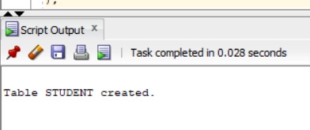
```
```
#4.Q4. Apply Primary Key constraint to SID, NOT NULL constraint to SNAME and Foreign Key constraint to DID.
```
ALTER TABLE STUDENT
ADD CONSTRAINT PK_STUDENT PRIMARY KEY (SID);

ALTER TABLE STUDENT
MODIFY SNAME NOT NULL;

ALTER TABLE STUDENT
ADD CONSTRAINT FK_STUDENT_DEPT
FOREIGN KEY (DID)
REFERENCES DEPT(DNO);
```
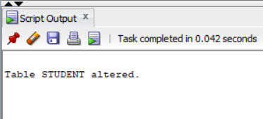
```
```
#4.Q5. Insert all department details like CSE, ME, CE, EEE, ECE, CSM, CSD.
```
INSERT INTO DEPT VALUES (10, 'CSE');
INSERT INTO DEPT VALUES (20, 'ME');
INSERT INTO DEPT VALUES (30, 'CE');
INSERT INTO DEPT VALUES (40, 'EEE');
INSERT INTO DEPT VALUES (50, 'ECE');
INSERT INTO DEPT VALUES (60, 'CSM');
INSERT INTO DEPT VALUES (70, 'CSD');
```
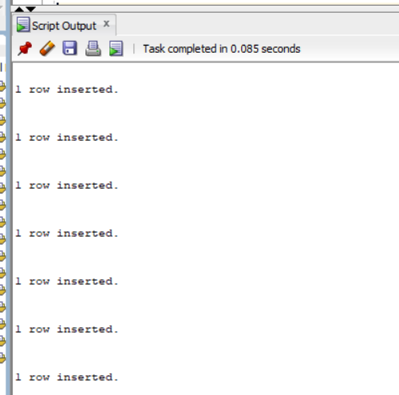
```
```
#4.Q6. Insert at least 10 rows in STUDENT table.
```
INSERT INTO STUDENT VALUES (101, 'Rahul', 10);
INSERT INTO STUDENT VALUES (102, 'Sneha', 20);
INSERT INTO STUDENT VALUES (103, 'Arjun', 30);
INSERT INTO STUDENT VALUES (104, 'Kiran', 40);
INSERT INTO STUDENT VALUES (105, 'Priya', 50);
INSERT INTO STUDENT VALUES (106, 'Nikhil', 60);
INSERT INTO STUDENT VALUES (107, 'Anu', 10);
INSERT INTO STUDENT VALUES (108, 'Ravi', 20);
INSERT INTO STUDENT VALUES (109, 'Divya', 50);
INSERT INTO STUDENT VALUES (110, 'Manoj', NULL);
```
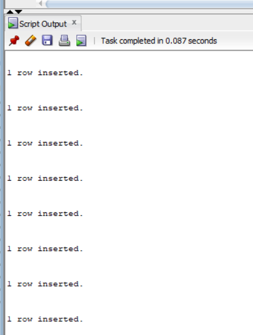
```
```
#4.Q7. SQL Query to implement NATURAL JOIN between Student and Dept
```
SELECT S.SID,
       S.SNAME,
       D.DNO,
       D.DNAME
FROM STUDENT S
JOIN DEPT D
ON S.DID = D.DNO;
```
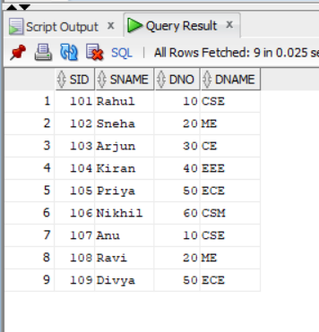
```
```
#4.Q8. SQL Query to implement EQUI JOIN between Student and Dept
```
SELECT S.SID,
       S.SNAME,
       D.DNAME
FROM STUDENT S
JOIN DEPT D
ON S.DID = D.DNO;
```
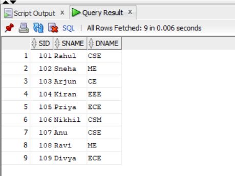
```
```
#4.Q9. SQL Query to implement CONDITIONAL JOIN between Student and Dept
```
SELECT S.SID,
       S.SNAME,
       D.DNAME
FROM STUDENT S
JOIN DEPT D
ON S.DID = D.DNO
AND S.SID > 105;
```
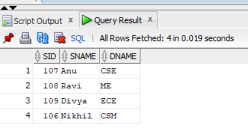
```
```
#4.Q10. SQL Query to implement LEFT OUTER NATURAL JOIN
```
SELECT S.SID,
       S.SNAME,
       D.DNAME
FROM STUDENT S
LEFT OUTER JOIN DEPT D
ON S.DID = D.DNO;
```
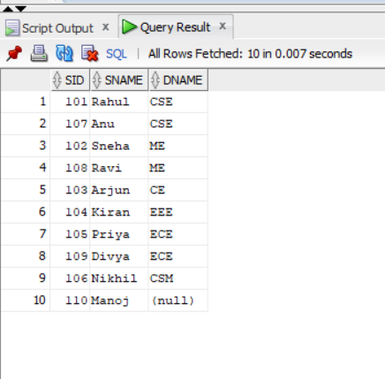
```
```
#4.Q11. SQL Query to implement RIGHT OUTER NATURAL JOIN
```
SELECT S.SID,
       S.SNAME,
       D.DNAME
FROM STUDENT S
RIGHT OUTER JOIN DEPT D
ON S.DID = D.DNO;
```
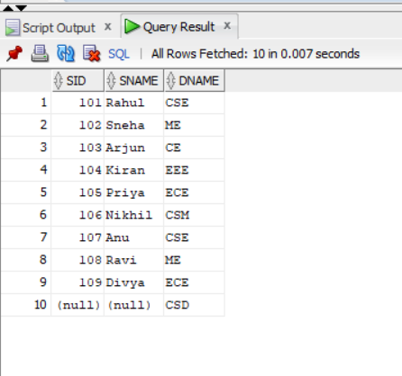
```
```
#4.Q12. SQL Query to implement FULL OUTER NATURAL JOIN
```
SELECT S.SID,
       S.SNAME,
       D.DNAME
FROM STUDENT S
FULL OUTER JOIN DEPT D
ON S.DID = D.DNO;
```
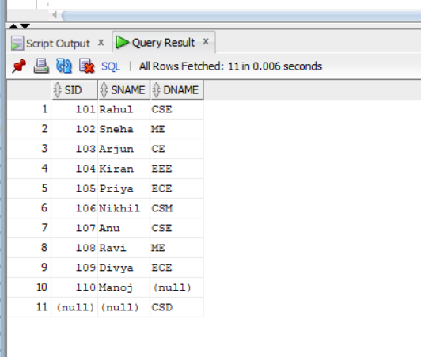
```
```
#4.Q13. SQL Query to implement LEFT OUTER EQUI JOIN
```
SELECT S.SID,
       S.SNAME,
       D.DNAME
FROM STUDENT S
LEFT OUTER JOIN DEPT D
ON S.DID = D.DNO;
```
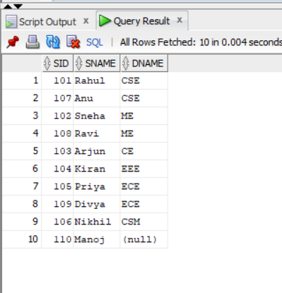
```
```
#4.Q14. SQL Query to implement RIGHT OUTER EQUI JOIN
```
SELECT S.SID,
       S.SNAME,
       D.DNAME
FROM STUDENT S
RIGHT OUTER JOIN DEPT D
ON S.DID = D.DNO;
```
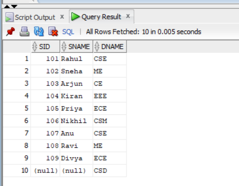
```
```
#4.Q15. SQL Query to implement FULL OUTER EQUI JOIN
```
SELECT S.SID,
       S.SNAME,
       D.DNAME
FROM STUDENT S
FULL OUTER JOIN DEPT D
ON S.DID = D.DNO;
```
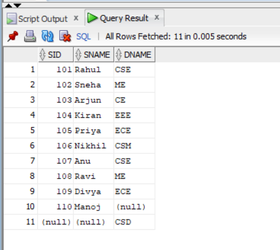
```
```
#4.Q16. SQL Query to implement LEFT OUTER CONDITIONAL JOIN
```
SELECT S.SID,
       S.SNAME,
       D.DNAME
FROM STUDENT S
LEFT OUTER JOIN DEPT D
ON S.DID = D.DNO
AND S.SID > 105;
```
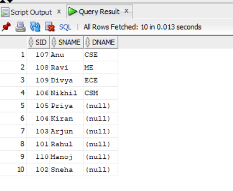
```
```
#Q17. SQL Query to implement RIGHT OUTER CONDITIONAL JOIN
```
SELECT S.SID,
       S.SNAME,
       D.DNAME
FROM STUDENT S
RIGHT OUTER JOIN DEPT D
ON S.DID = D.DNO
AND S.SID > 105;
```
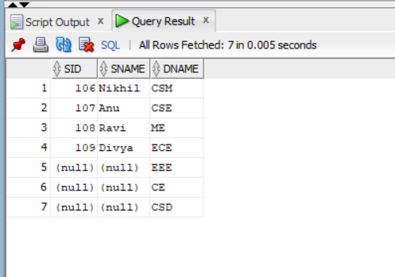
```
```
#4.Q18. SQL Query to implement FULL OUTER CONDITIONAL JOIN
```
SELECT S.SID,
       S.SNAME,
       D.DNAME
FROM STUDENT S
FULL OUTER JOIN DEPT D
ON S.DID = D.DNO
AND S.SID > 105;
```
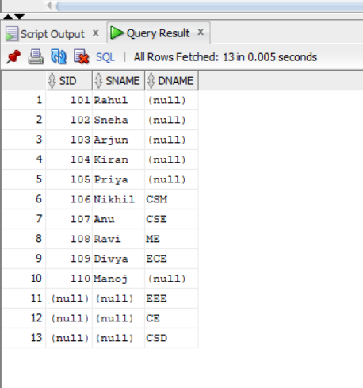
```
```
#4.Q19. SQL Query to implement CROSS JOIN between Student and Dept
```
SELECT S.SID,
       S.SNAME,
       D.DNO,
       D.DNAME
FROM STUDENT S
CROSS JOIN DEPT D;
```
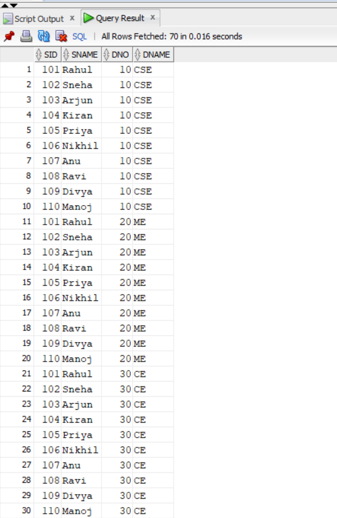
```
```
#4.Q21. Practice how to apply the above JOIN operations for the queries asked in WEEK 2 Experiment
```
1. INNER JOIN
SELECT S.SID, S.SNAME, D.DNAME
FROM STUDENT S
INNER JOIN DEPT D
ON S.DID = D.DNO;
2. LEFT OUTER JOIN
SELECT S.SID, S.SNAME, D.DNAME
FROM STUDENT S
LEFT OUTER JOIN DEPT D
ON S.DID = D.DNO;
3. RIGHT OUTER JOIN
SELECT S.SID, S.SNAME, D.DNAME
FROM STUDENT S
RIGHT OUTER JOIN DEPT D
ON S.DID = D.DNO;
4. FULL OUTER JOIN
SELECT S.SID, S.SNAME, D.DNAME
FROM STUDENT S
FULL OUTER JOIN DEPT D
ON S.DID = D.DNO;
5. CROSS JOIN
SELECT S.SID, S.SNAME, D.DNO, D.DNAME
FROM STUDENT S
CROSS JOIN DEPT D;
6. Conditional JOIN
SELECT S.SID, S.SNAME, D.DNAME
FROM STUDENT S
JOIN DEPT D
ON S.DID = D.DNO
AND S.SID > 105;
```
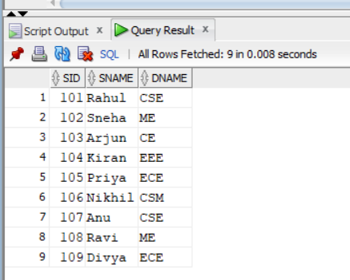
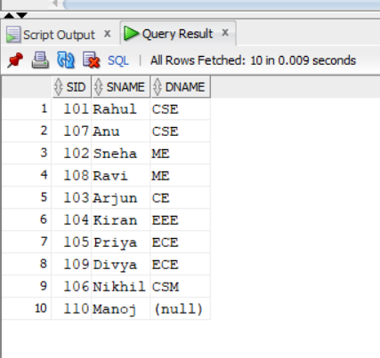
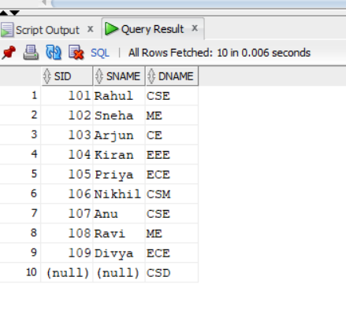
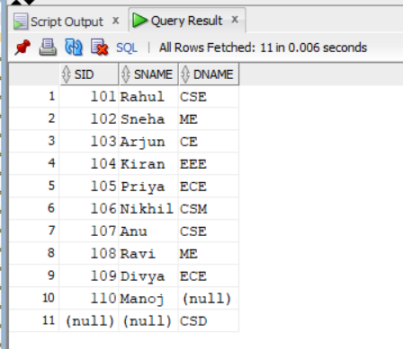
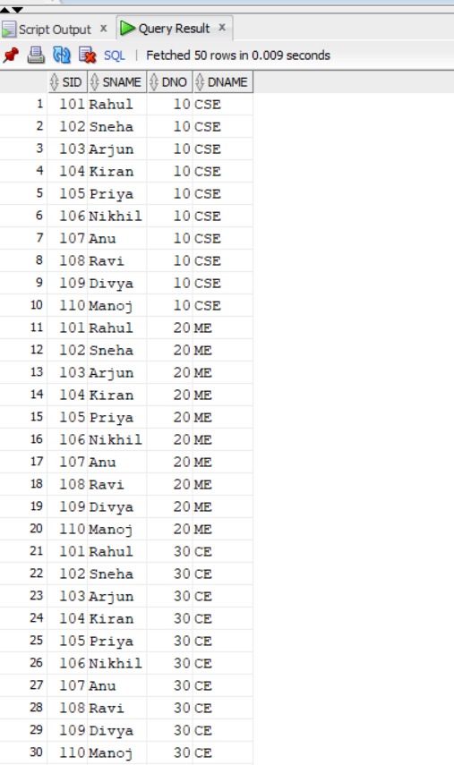
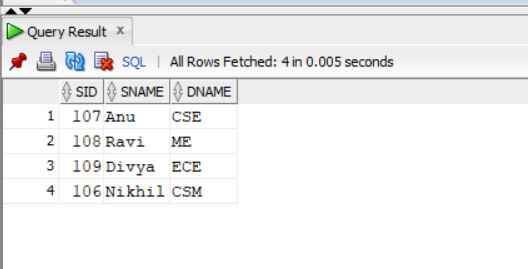
```
```

