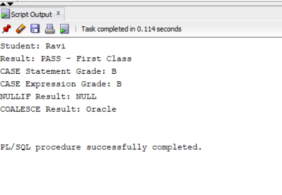
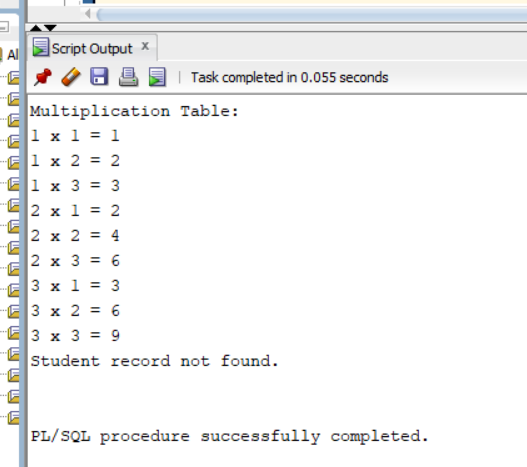

#6.A.PL/SQL SOURCE CODE
```
SET SERVEROUTPUT ON;

DECLARE
    v_name      VARCHAR2(30) := 'Ravi';
    v_marks     NUMBER := 75;
    v_grade     VARCHAR2(10);
    v_nullif    NUMBER;
    v_coalesce  VARCHAR2(30);

BEGIN
    -- 1. Nested IF Statement
    IF v_marks >= 35 THEN
        IF v_marks >= 60 THEN
            DBMS_OUTPUT.PUT_LINE('Student: ' || v_name);
            DBMS_OUTPUT.PUT_LINE('Result: PASS - First Class');
        ELSE
            DBMS_OUTPUT.PUT_LINE('Student: ' || v_name);
            DBMS_OUTPUT.PUT_LINE('Result: PASS');
        END IF;
    ELSE
        DBMS_OUTPUT.PUT_LINE('Student: ' || v_name);
        DBMS_OUTPUT.PUT_LINE('Result: FAIL');
    END IF;

    -- 2. CASE Statement
    CASE
        WHEN v_marks >= 90 THEN
            DBMS_OUTPUT.PUT_LINE('CASE Statement Grade: A+');
        WHEN v_marks >= 80 THEN
            DBMS_OUTPUT.PUT_LINE('CASE Statement Grade: A');
        WHEN v_marks >= 70 THEN
            DBMS_OUTPUT.PUT_LINE('CASE Statement Grade: B');
        WHEN v_marks >= 60 THEN
            DBMS_OUTPUT.PUT_LINE('CASE Statement Grade: C');
        WHEN v_marks >= 35 THEN
            DBMS_OUTPUT.PUT_LINE('CASE Statement Grade: D');
        ELSE
            DBMS_OUTPUT.PUT_LINE('CASE Statement Grade: F');
    END CASE;

    -- 3. CASE Expression
    v_grade :=
        CASE
            WHEN v_marks >= 90 THEN 'A+'
            WHEN v_marks >= 80 THEN 'A'
            WHEN v_marks >= 70 THEN 'B'
            WHEN v_marks >= 60 THEN 'C'
            WHEN v_marks >= 35 THEN 'D'
            ELSE 'F'
        END;

    DBMS_OUTPUT.PUT_LINE('CASE Expression Grade: ' || v_grade);

    -- 4. NULLIF Function
    v_nullif := NULLIF(80, 80);

    IF v_nullif IS NULL THEN
        DBMS_OUTPUT.PUT_LINE('NULLIF Result: NULL');
    ELSE
        DBMS_OUTPUT.PUT_LINE('NULLIF Result: ' || v_nullif);
    END IF;

    -- 5. COALESCE Function
    v_coalesce := COALESCE(NULL, NULL, 'Oracle', 'Database');

    DBMS_OUTPUT.PUT_LINE('COALESCE Result: ' || v_coalesce);

EXCEPTION
    WHEN OTHERS THEN
        DBMS_OUTPUT.PUT_LINE('Error: ' || SQLERRM);
END;
/
```

```
```
#6.B.PL/SQL Source Code
```
  GNU nano 9.1                                   readme.md                                   Modified
    v_grade :=
        CASE
            WHEN v_marks >= 90 THEN 'A+'
            WHEN v_marks >= 80 THEN 'A'
            WHEN v_marks >= 70 THEN 'B'
            WHEN v_marks >= 60 THEN 'C'
            WHEN v_marks >= 35 THEN 'D'
            ELSE 'F'
        END;

    DBMS_OUTPUT.PUT_LINE('CASE Expression Grade: ' || v_grade);

    -- 4. NULLIF Function
    v_nullif := NULLIF(80, 80);

    IF v_nullif IS NULL THEN
        DBMS_OUTPUT.PUT_LINE('NULLIF Result: NULL');
    ELSE
        DBMS_OUTPUT.PUT_LINE('NULLIF Result: ' || v_nullif);
    END IF;

    -- 5. COALESCE Function
    v_coalesce := COALESCE(NULL, NULL, 'Oracle', 'Database');

    DBMS_OUTPUT.PUT_LINE('COALESCE Result: ' || v_coalesce);

EXCEPTION
    WHEN OTHERS THEN
        DBMS_OUTPUT.PUT_LINE('Error: ' || SQLERRM);
END;
/
```

```
```
#6.B.PL/SQL Source Code
```
SET SERVEROUTPUT ON;

DECLARE
    v_name      VARCHAR2(30) := 'Ravi';
    v_marks     NUMBER := 75;
    v_grade     VARCHAR2(10);
    v_nullif    NUMBER;
    v_coalesce  VARCHAR2(30);

BEGIN
    -- 1. Nested IF Statement
    IF v_marks >= 35 THEN
        IF v_marks >= 60 THEN
            DBMS_OUTPUT.PUT_LINE('Student: ' || v_name);
            DBMS_OUTPUT.PUT_LINE('Result: PASS - First Class');
        ELSE
            DBMS_OUTPUT.PUT_LINE('Student: ' || v_name);
            DBMS_OUTPUT.PUT_LINE('Result: PASS');
        END IF;
    ELSE
        DBMS_OUTPUT.PUT_LINE('Student: ' || v_name);
        DBMS_OUTPUT.PUT_LINE('Result: FAIL');
    END IF;

    -- 2. CASE Statement
    CASE
        WHEN v_marks >= 90 THEN
            DBMS_OUTPUT.PUT_LINE('CASE Statement Grade: A+');
        WHEN v_marks >= 80 THEN
            DBMS_OUTPUT.PUT_LINE('CASE Statement Grade: A');
        WHEN v_marks >= 70 THEN
            DBMS_OUTPUT.PUT_LINE('CASE Statement Grade: B');
        WHEN v_marks >= 60 THEN
            DBMS_OUTPUT.PUT_LINE('CASE Statement Grade: C');
        WHEN v_marks >= 35 THEN
            DBMS_OUTPUT.PUT_LINE('CASE Statement Grade: D');
        ELSE
            DBMS_OUTPUT.PUT_LINE('CASE Statement Grade: F');
    END CASE;

    -- 3. CASE Expression
    v_grade :=
        CASE
            WHEN v_marks >= 90 THEN 'A+'
            WHEN v_marks >= 80 THEN 'A'
            WHEN v_marks >= 70 THEN 'B'
            WHEN v_marks >= 60 THEN 'C'
            WHEN v_marks >= 35 THEN 'D'
            ELSE 'F'
        END;

    DBMS_OUTPUT.PUT_LINE('CASE Expression Grade: ' || v_grade);

    -- 4. NULLIF Function
    v_nullif := NULLIF(80, 80);

    IF v_nullif IS NULL THEN
        DBMS_OUTPUT.PUT_LINE('NULLIF Result: NULL');
    ELSE
        DBMS_OUTPUT.PUT_LINE('NULLIF Result: ' || v_nullif);
    END IF;

    -- 5. COALESCE Function
    v_coalesce := COALESCE(NULL, NULL, 'Oracle', 'Database');

    DBMS_OUTPUT.PUT_LINE('COALESCE Result: ' || v_coalesce);

EXCEPTION
    WHEN OTHERS THEN
        DBMS_OUTPUT.PUT_LINE('Error: ' || SQLERRM);
END;
/
```

```
```

