# EXPERIMENT - 9

# Program 1: BEFORE Trigger

# 1. Create the STUDENT Table
```

CREATE TABLE student (
    student_id   NUMBER(5) PRIMARY KEY,
    student_name VARCHAR2(50),
    course       VARCHAR2(30),
    marks        NUMBER(5,2)
);
```
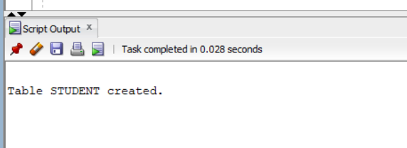
```
```
# 2. Create the BEFORE INSERT Trigger
```
CREATE OR REPLACE TRIGGER trg_student_before_insert
BEFORE INSERT ON student
FOR EACH ROW
BEGIN

    -- Validate Student ID
    IF :NEW.student_id <= 0 THEN
        RAISE_APPLICATION_ERROR(
            -20001,
            'Student ID must be greater than 0.'
        );
    END IF;

    -- Validate Student Name
    IF :NEW.student_name IS NULL THEN
        RAISE_APPLICATION_ERROR(
            -20002,
            'Student Name cannot be NULL.'
        );
    END IF;

    -- Validate Marks
    IF :NEW.marks < 0 OR :NEW.marks > 100 THEN
        RAISE_APPLICATION_ERROR(
            -20003,
            'Marks must be between 0 and 100.'
    END IF;

END;
/
```
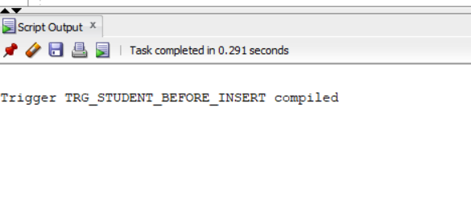
```
```
# 3. Insert a Valid Record
```
VALUES (101, 'Ravi', 'CSE', 85);

COMMIT;
```
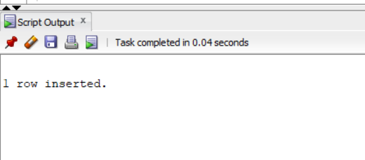
```
```
# 4. Insert an Invalid Record
```
INSERT INTO student
VALUES (102, 'Sita', 'ECE', 120);
INSERT INTO student
VALUES (-103, 'Kiran', 'EEE', 75);
```
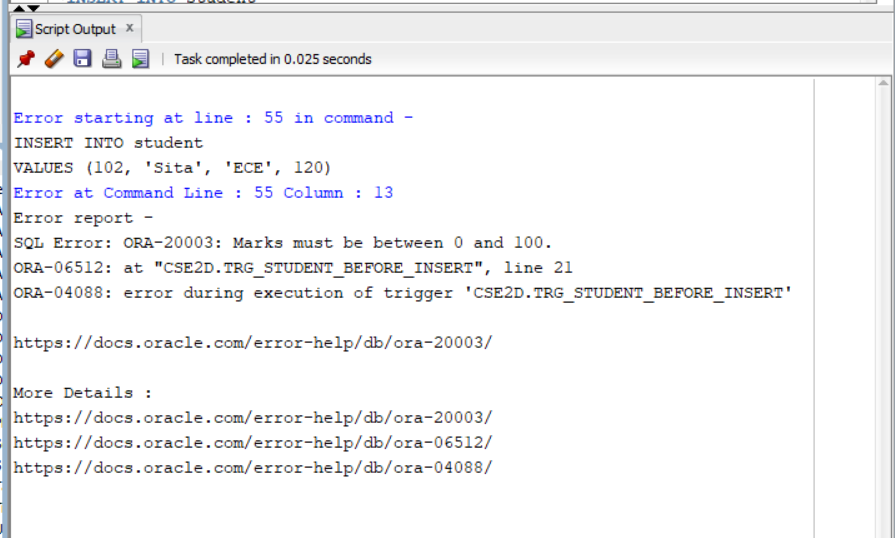
```
```
# 6. Display the Final Table
```
SELECT * FROM student;
```
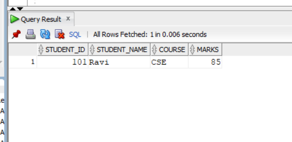
```
```
# Program 2: AFTER Trigger
# 1. Create the Main Table
```
CREATE TABLE student (
    student_id   NUMBER(5) PRIMARY KEY,
    student_name VARCHAR2(50),
    course       VARCHAR2(30),
    marks        NUMBER(5,2)
```
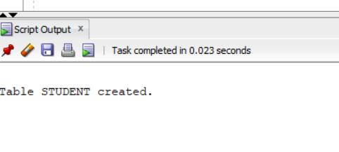
```
```
# 2. Create the Audit Table
```
CREATE TABLE student_audit (
    audit_id      NUMBER(5),
    student_id    NUMBER(5),
    student_name  VARCHAR2(50),
    course        VARCHAR2(30),
    action        VARCHAR2(20),
    action_date   DATE
);
```
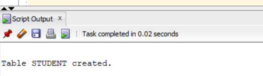
```
```
# 3. Create a Sequence for the Audit ID
```
START WITH 1
INCREMENT BY 1;
```
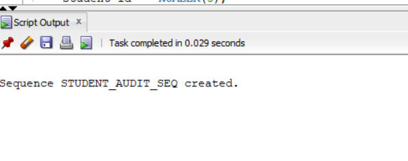
```
```
# 4. Create the AFTER INSERT Trigger
```
CREATE OR REPLACE TRIGGER trg_student_after_insert
AFTER INSERT ON student
FOR EACH ROW
BEGIN
    INSERT INTO student_audit (
        audit_id,
        student_name,
        course,
        action,
        action_date
    )
    VALUES (
        student_audit_seq.NEXTVAL,
        :NEW.student_id,
        :NEW.student_name,
        :NEW.course,
        :NEW.marks,
        'INSERT',
    );

/
```
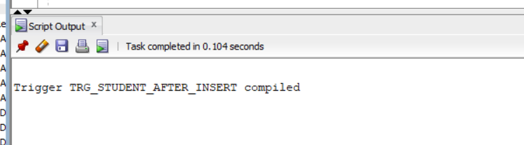
```
```
# 5. Insert a New Record into the Main Table
```
INSERT INTO student
VALUES (101, 'Ravi', 'CSE', 85);

COMMIT;
```
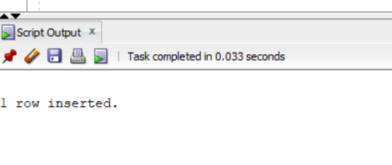
```
```
# 6. Verify the Main Table
```
SELECT * FROM student;
```
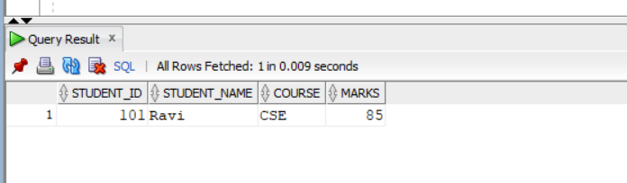
```
```
# 7. Display the Audit Table
```
SELECT * FROM student_audit;
```
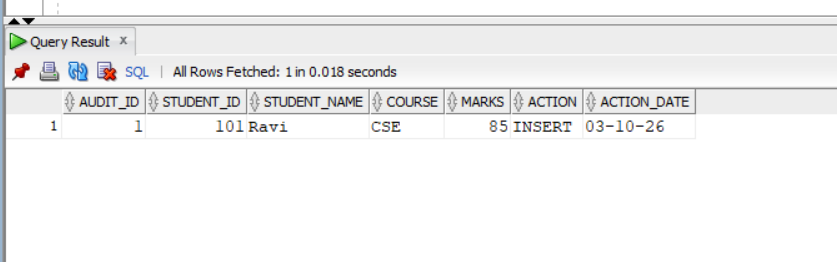
```
```
# Program 3: Row-Level Trigger
# 1. Create the EMPLOYEE Table
```
CREATE TABLE employee (
    employee_id   NUMBER(5) PRIMARY KEY,
    employee_name VARCHAR2(50),
    department    VARCHAR2(30),
    salary        NUMBER(10,2)
);
```
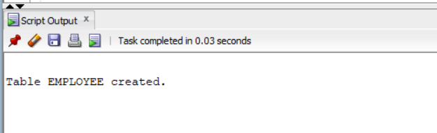
```
```
# 2. Insert Sample Employee Records
```
INSERT INTO employee VALUES (101, 'Ravi', 'CSE', 30000);
INSERT INTO employee VALUES (102, 'Sita', 'ECE', 35000);
INSERT INTO employee VALUES (103, 'Kiran', 'EEE', 40000);
INSERT INTO employee VALUES (104, 'Anjali', 'CSE', 45000);

COMMIT;
```
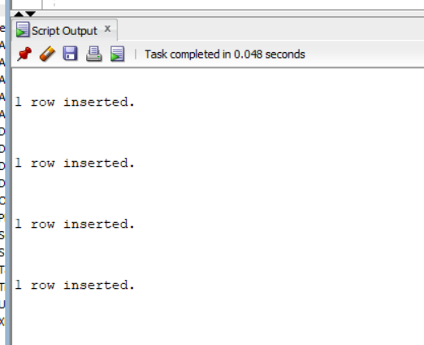
```
```
# 3. Create the BEFORE UPDATE Trigger
```

CREATE OR REPLACE TRIGGER trg_employee_before_update
BEFORE UPDATE ON employee
FOR EACH ROW
BEGIN

    -- Compare old and new salary
    IF :NEW.salary < :OLD.salary THEN

        RAISE_APPLICATION_ERROR(
            -20001,
            'Salary cannot be decreased.'
        );

    END IF;

END;
/
```
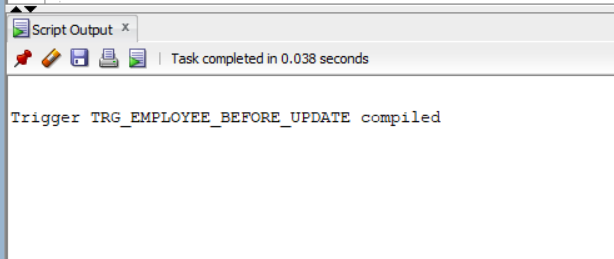
```
```
# 4. Update a Valid Record
```
UPDATE employee
SET salary = 33000

WHERE employee_id = 101;

COMMIT;
```
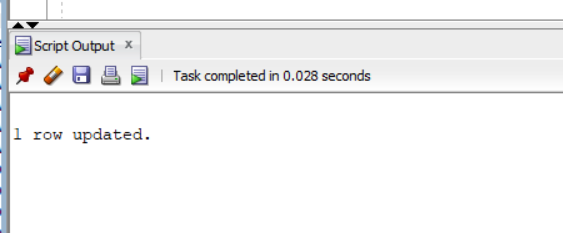
```
```
# 5. Update an Invalid Record
```
UPDATE employee
SET salary = 28000

WHERE employee_id = 101;
```
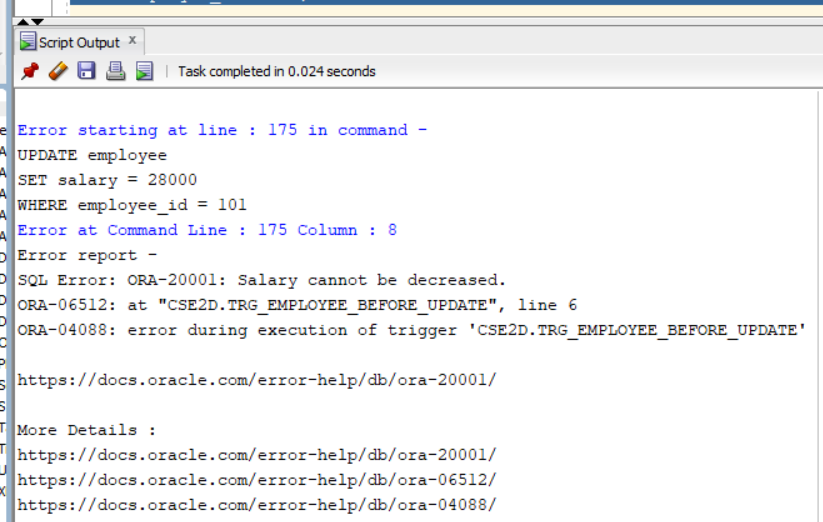
```
```
# 6. Display the Table Contents
```
SELECT * FROM employee;
```
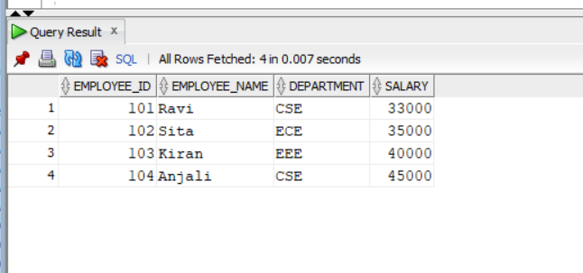
```
```
# Program 4: Statement-Level Trigger
# 1. Create the Main Table
```
CREATE TABLE employee (
    employee_id   NUMBER(5) PRIMARY KEY,
    employee_name VARCHAR2(50),
    department    VARCHAR2(30),
    salary        NUMBER(10,2)
```
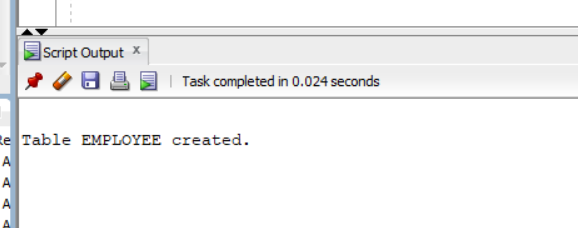
```
```
# 2. Insert Sample Records
```
INSERT INTO employee VALUES (101, 'Ravi', 'CSE', 30000);
INSERT INTO employee VALUES (102, 'Sita', 'ECE', 35000);
INSERT INTO employee VALUES (103, 'Kiran', 'EEE', 40000);
INSERT INTO employee VALUES (104, 'Anjali', 'CSE', 45000);
INSERT INTO employee VALUES (105, 'Rahul', 'ECE', 38000);
```
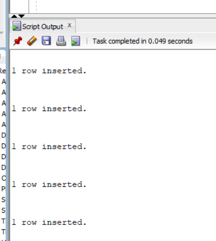
```
```

# 3. Create the Log Table
```
CREATE TABLE employee_delete_log (
    delete_date   DATE
START WITH 1
```
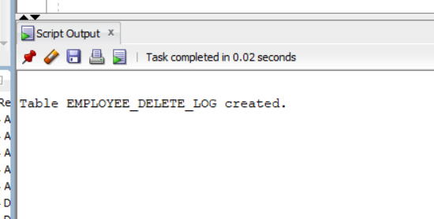
```
```
# 4. Create a Sequence for the Log ID
```

CREATE SEQUENCE employee_delete_log_seq
);
    message       VARCHAR2(200),
    log_id        NUMBER(5),
COMMIT;
);

END;
        SYSDATE
        marks,
        student_id,


END;

SELECT trigger_name, status
WHERE trigger_name = 'TRG_EMPLOYEE_AFTER_DELETE';
```
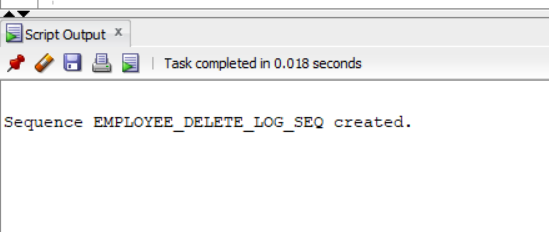
```
```
# 5. Create the AFTER DELETE Statement-Level Trigger
```
CREATE OR REPLACE TRIGGER trg_employee_after_delete
AFTER DELETE ON employee
BEGIN

    INSERT INTO employee_delete_log (
        log_id,
        message,
        delete_date
    )
    VALUES (
        employee_delete_log_seq.NEXTVAL,
        'DELETE statement executed on EMPLOYEE table.',
        SYSDATE
    );

    DBMS_OUTPUT.PUT_LINE(
        'DELETE statement executed successfully.'
    );

END;
```
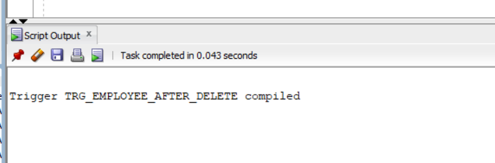
```
```
# 6. Verify the Trigger
```
SELECT trigger_name, status
FROM user_triggers
WHERE trigger_name = 'TRG_EMPLOYEE_AFTER_DELETE';
```
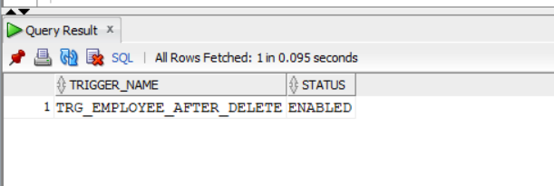
```
```
# 7. Delete One Record
```
SET SERVEROUTPUT ON;
DELETE FROM employee
WHERE employee_id = 101;

COMMIT;
```
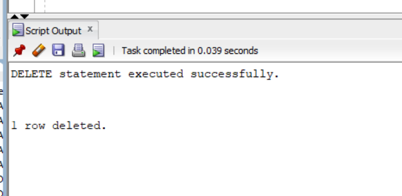
```
```
# 8. Verify the DELETE Operation
```
SELECT * FROM employee;
```
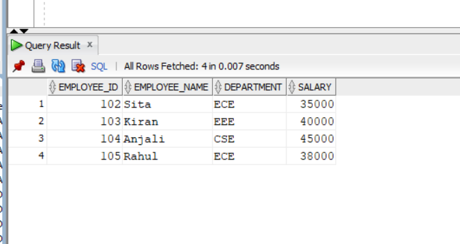
```
```
# 9. Test Statement-Level Behavior
```
DELETE FROM employee
WHERE department = 'ECE';

COMMIT;
```
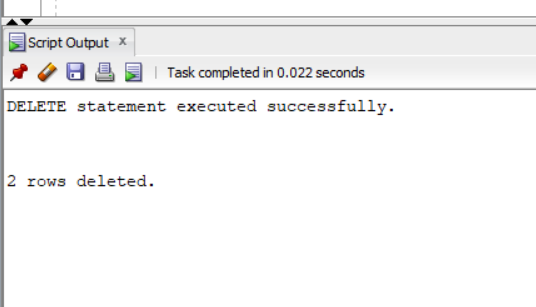
```
```
# 10. Display the Log Table
```
SELECT * FROM employee_delete_log;

```
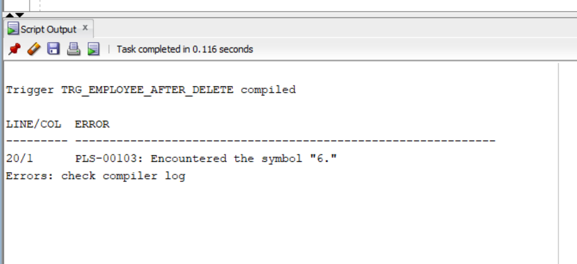
```
```
# Program 5: INSTEAD OF Trigger
```
Create COURSE Table

CREATE TABLE course (
    course_id   NUMBER(5) PRIMARY KEY,
    course_name VARCHAR2(50)
);
```
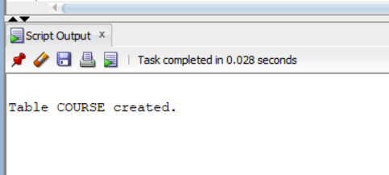
```
```
#Create STUDENT Table
```

CREATE TABLE student (
    student_id   NUMBER(5) PRIMARY KEY,
    student_name VARCHAR2(50),
    course_id    NUMBER(5),
    marks        NUMBER(5,2),
    CONSTRAINT fk_student_course
        FOREIGN KEY (course_id)
        REFERENCES course(course_id)
);
```
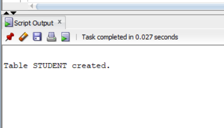
```
```
# 2. Insert Sample Records
```
Insert Course Records
INSERT INTO course VALUES (1, 'Computer Science');
INSERT INTO course VALUES (2, 'Electronics');
INSERT INTO course VALUES (3, 'Electrical');

COMMIT;
```
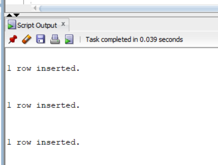
```
```
#
```
Insert Student Records
INSERT INTO student VALUES (101, 'Ravi', 1, 85);
INSERT INTO student VALUES (102, 'Sita', 2, 90);
INSERT INTO student VALUES (103, 'Kiran', 3, 78);
INSERT INTO student VALUES (104, 'Anjali', 1, 88);
```
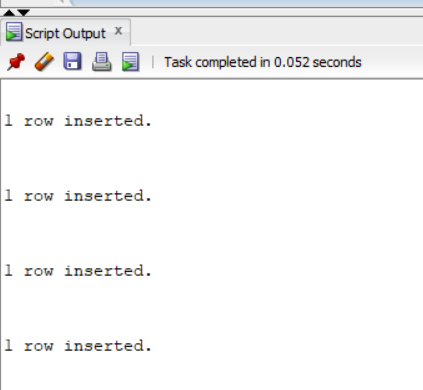
```
```
# 7. Verify the View
```
SELECT * FROM student_course_view;
```
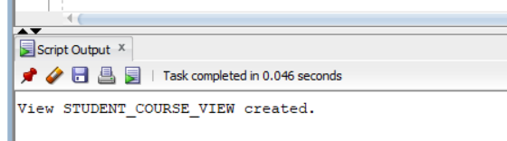
```
```


# 3. Create a View
```
SELECT * FROM student;
CREATE OR REPLACE VIEW student_course_view AS
SELECT

COMMIT;
```
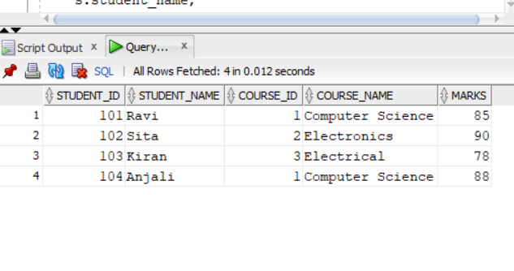
```
```
# 6. Verify the Base Table
 ```
   s.student_id,
    s.student_name,
    s.course_id,
SET marks = 95
WHERE student_id = 101;
    c.course_name,
END;
```
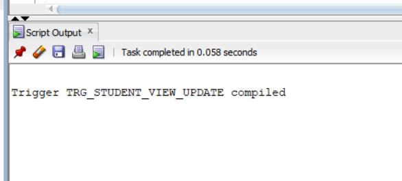
```
```
# 5. Update the View
```
UPDATE student_course_view
    s.marks
    WHERE student_id = :OLD.student_id;

FROM student s
JOIN course c
    ON s.course_id = c.course_id;
        marks = :NEW.marks


        student_name = :NEW.student_name,
Display the View
SELECT * FROM student_course_view;
    SET
BEGIN

    UPDATE student
```
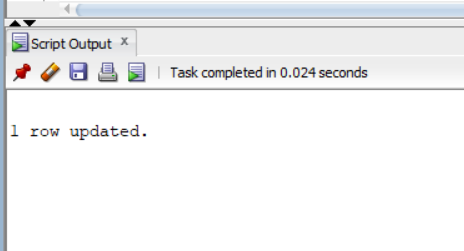
```
```
# 4. Create the INSTEAD OF UPDATE Trigger
```
CREATE OR REPLACE TRIGGER trg_student_view_update
INSTEAD OF UPDATE ON student_course_view
FOR EACH ROW


FROM user_triggers
```
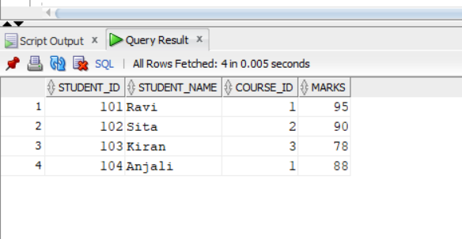
```
```
# 6. Verify the Trigger
```
    DBMS_OUTPUT.PUT_LINE(
        'DELETE statement executed successfully.'
    );
    VALUES (
        employee_delete_log_seq.NEXTVAL,
        'DELETE statement executed on EMPLOYEE table.',
        SYSDATE
    );

CREATE SEQUENCE student_audit_seq
BEGIN
    INSERT INTO employee_delete_log (
        log_id,
        message,
        delete_date
    )

    marks         NUMBER(5,2),
);

AFTER DELETE ON employee
INCREMENT BY 1;

CREATE OR REPLACE TRIGGER trg_employee_after_delete

5. Create the AFTER DELETE Statement-Level Trigger
5. Test Another Invalid Record
INSERT INTO student
```
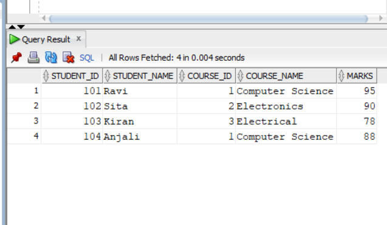
```
```
